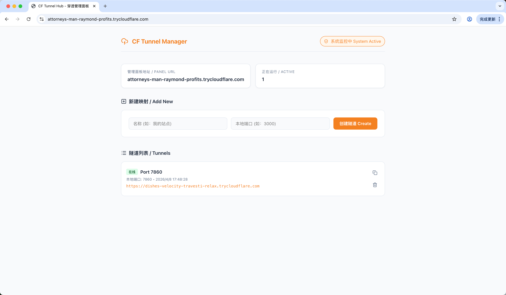

# 🚀 CF_Tunnel

[中文文档](./README_CN.md)

A lightweight engine for Cloudflare Tunnels with a professional management dashboard. Easily expose your local services (Web, SSH, API, etc.) to the internet without a public IP or port forwarding.




## ✨ Features

- **One-Click Setup**: Fully automated installation script for Windows, Linux, and macOS.
- **Smart Dependency Management**: Automatically detects and installs Node.js, npm, and the latest `cloudflared` binary.
- **Unlimited Port Mappings**: Create as many tunnels as you need without any software limits.
- **Modern Dashboard**: High-end minimalist user interface with dark/light mode support.
- **Zero Configuration**: Uses Cloudflare "Quick Tunnels" (TryCloudflare) for instant public URLs.
- **Bilingual Support**: Native Chinese and English interface support.

---

## 🚀 One-Click Installation

### 🪟 Windows (PowerShell)
Open PowerShell and run:
```powershell
iwr -useb https://cft.imdaxia.com/install.ps1 | iex
```

### 🍎 Linux / macOS
Open your terminal and run:
```bash
curl -sSL https://cft.imdaxia.com/install.sh | bash
```

---

## 📖 How to Use

1.  **Launch**: Run the one-click script above.
2.  **Access Panel**: Wait for the script to finish and click the **Access Link** displayed in your terminal.
3.  **Create Tunnels**: Enter your local port in the dashboard and click **Create Tunnel**.

---

## 🛠️ Manual Installation (Fallback)
If the automated scripts fail, follow these steps:

1. **Install Node.js**: Download from [nodejs.org](https://nodejs.org/) (LTS recommended).
2. **Download Project**:
   ```bash
   git clone https://github.com/pingpm/CF_Tunnel_webui.git
   cd CF_Tunnel_webui
   ```
3. **Install Dependencies**:
   ```bash
   npm install
   ```
4. **Start Server**:
   ```bash
   node server/index.js
   ```
5. **Open Dashboard**: Go to `http://localhost:11122`.

---

## ⚠️ Important Note
*   **Session-based**: Actions are tied to the current process. Closing the terminal or stopping the app will invalidate all tunnels.
*   **Background Run**: Use [PM2](https://pm2.keymetrics.io/) to keep it running 24/7:
    ```bash
    npm install -g pm2
    pm2 start server/index.js --name cf-tunnel
    ```
